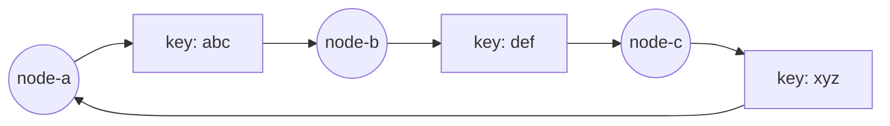

import Quiz from '../../components/Quiz.astro';

## 始め方

リポジトリのルートで、Day 14 の演習を始めます。

```bash
./study start 14
```

`work/` に、実装する関数が `panic("TODO: ...")` になった Go コードが用意されます。まずは何も直さずに次を実行し、テストが落ちることを確認してから始めましょう。

```bash
./study test
```

:::note[このページのコードについて]
このページは Day 14 時点のコードを解説しています。`./study start 14` で当時の状態から演習を始められます。模範解答は `./study peek <パス>` で読めます。
:::

## 今日のゴール

- 1 台の DB が接続数、CPU、メモリ、書き込み IOPS で限界を迎える理由を説明できるようになる。
- リードレプリカ、非同期レプリケーション、レプリケーションラグ、read-your-writes 問題を理解する。
- シャーディングの range 方式と hash 方式、ホットスポット、リシャーディングの痛みを説明できるようになる。
- `hash(key) % N` の問題と、consistent hashing のリング、時計回りの割り当て、仮想ノードを説明できるようになる。
- `app/internal/cluster/hashring.go` の `sort.Search`、ハッシュ選定、再配置率、標準偏差のテストを読めるようになる。
- CAP 定理、CDN/エッジ、世界規模の shortlink 設計を URL 短縮サービスに対応づけられるようになる。

## 今日つくるもの

- `app/internal/cluster/hashring.go`
  - `NewHashRing(replicas int) *HashRing` は、指定された数の仮想ノードを使う空のリングを返す。`replicas` が 0 以下なら 1 として扱う。
  - `(*HashRing).AddNode(node string)` は、実ノードとその仮想ノードを追加する。空のノード名と、すでにあるノード名はリングを変えずに扱う。
  - `(*HashRing).RemoveNode(node string)` は、実ノードと対応する仮想ノードをすべて削除する。存在しないノード名では何も変更しない。
  - `(*HashRing).GetNode(key string) (node string, ok bool)` は、key を担当する実ノードを決定的に返す。リングが空なら `("", false)`、ノードがあれば担当ノードと `true` を返す。
  - `(*HashRing).sortPoints()`、`virtualNodeKey(node string, replica int) string`、`hashKey(key string) uint64` は、仮想ノードを区別でき、リング上の点を安定した順序で探索できる状態を保つ。ハッシュは同じ入力に同じ値を返し、key と node を十分に分散させる。
  - 公開メソッドは並行利用できること。追加・削除中の読み取りでも内部の map や slice を壊さず、ノードがあるリングで `GetNode` が失敗しないこと。
- HashRing が満たす契約
  - 同じ key は、リングが変わらない限り同じ node に割り当てられること。
  - ノード追加時は大半の key を元の node に残し、10 台から 11 台へ増やしたときの移動率が約 `1/11` になること。
  - ノード削除時は、そのノードが担当していなかった key の割り当てを変えないこと。
  - 仮想ノードを 1 から 200 に増やすと、10 台への割り当ての標準偏差が明確に小さくなること。
  - Day 14 ではサーバ本体や HTTP API の契約は変更せず、HashRing は将来 Redis や DB の shard 選択に使える独立したライブラリとして仕上げること。
- 合格条件
  - `./study todo` で未実装が残らず、`./study test` の build、vet、race detector 付きテストがすべて通ること。
  - `./study run` で既存の URL 短縮 API が起動し、リクエストへこれまでどおり応答すること。

## 解説

Day 13 では、入口で守る話をしました。レートリミット、タイムアウト、リクエストボディ防御によって、下流の DB や Redis をむやみに壊さないようにしました。

今日は、下流そのものをさらに大きくする話です。1 台の DB を強いマシンにするだけでは、いつか限界が来ます。読む量を増やすならレプリカ、書く量を増やすならシャーディング、世界中から速く返すなら CDN やエッジが候補になります。

ただし、分散は魔法ではありません。ノードを増やすと、データの置き場所、再配置、ラグ、障害時の一貫性、キャッシュの有効期限を考える必要が出ます。今日は理論中心ですが、抽象論で終わらせず、URL 短縮サービスの `code -> URL` という小さなデータに引きつけて考えます。

### 1 台の DB の限界

最初のシステムでは、1 台の DB にすべてを入れるのが自然です。構成が単純で、トランザクションも分かりやすく、運用も楽です。Day 4 から Day 10 までの教材も、まずはこの形で進めてきました。

しかし、利用者が増えると、DB はいくつかの限界に当たります。

1 つ目は接続数です。アプリの Pod を増やすと、各 Pod が DB 接続プールを持ちます。10 Pod がそれぞれ 20 接続を持てば、DB から見ると最大 200 接続です。接続はただの数字ではなく、メモリやスケジューリングのコストを持ちます。アプリだけを水平スケールしても、DB が接続をさばけなければ全体は伸びません。

2 つ目は CPU とメモリです。インデックス検索、ソート、JOIN、トランザクション管理、WAL の処理は DB の CPU を使います。よく使うページがメモリに乗っていれば速いですが、ワーキングセットがメモリを超えるとディスク読み込みが増えます。

3 つ目は書き込み IOPS です。URL 短縮サービスでは `POST /api/links` のたびに `code` と元 URL を保存します。永続化する DB は、書いたことを失わないためにログやデータページをディスクへ反映します。SSD でも無限に速いわけではありません。大量の書き込みが集中すると、ここが詰まります。

読み取りはキャッシュでかなり逃がせます。Day 8 の Redis は、人気の短縮コードを DB から外へ逃がしました。それでもキャッシュミス、作成処理、管理画面、集計処理など、DB に来る仕事は残ります。

そこで、まず読みを増やす方法としてリードレプリカを考えます。

### 読みのスケール: リードレプリカ

リードレプリカは、書き込みを受ける primary DB と、その変更を追いかける replica DB を分ける構成です。アプリは書き込みを primary に送り、読み取りの一部を replica に逃がします。

```txt title="リードレプリカの基本形"
POST /api/links  -> primary DB
GET /{code}      -> Redis -> replica DB
                            -> primary DB (404 や read-your-writes が必要な場合のみ)
```

読みが圧倒的に多いサービスでは効果があります。URL 短縮サービスも典型です。短縮 URL は 1 回作られたあと、何度もリダイレクトされます。通常の読みは Redis、次に replica DB へ逃がし、404 や read-your-writes が必要な場合だけ primary DB へ戻す形にすると、primary への負荷を抑えやすくなります。

多くのレプリケーションは非同期です。primary は書き込みを受けて成功を返し、そのあと変更ログを replica へ送ります。replica は少し遅れて同じ状態に追いつきます。

この遅れをレプリケーションラグと呼びます。ラグが 50ms のこともあれば、負荷やネットワーク状態によって数秒になることもあります。ラグがあると、書いた直後に読んだのに古い値が返ることがあります。

URL 短縮サービスで考えます。ユーザーが `POST /api/links` で新しい code を作り、すぐブラウザで短縮 URL を開いたとします。`GET /{code}` が replica だけを見る構成だと、replica がまだその code を知らず 404 を返すかもしれません。これが read-your-writes 問題です。「自分が書いたものを自分で読めない」状態です。

対策はいくつかあります。

- 作成直後の確認や管理画面では primary から読む。
- ユーザーセッションに「最近書いた code」を覚え、一定時間だけ primary に向ける。
- 書き込み成功後、replica が追いつくまで待ってから成功を返す。
- 404 のときだけ primary にフォールバックする。
- 作成後すぐ使う code は Redis に write-through して、リダイレクトはキャッシュから返す。

どれが正しいかはサービスの性質次第です。短縮 URL の作成直後に 404 が出ると体験は悪いので、少なくとも「作成直後の本人」には primary か Redis から読ませたいです。一方で、世界中のすべての読者に対して常に最新を強制すると、レイテンシや可用性を犠牲にします。

読みを増やすならリードレプリカでかなり進めます。では、書き込み自体が増えたらどうするのでしょうか。

### 書きのスケール: シャーディング

シャーディングは、データを複数の DB に分けて持つ設計です。1 台の DB が全 code を持つのではなく、`shard-a`、`shard-b`、`shard-c` のように分けます。

```txt title="code ごとに保存先 DB を分ける"
code=00abc -> shard-a
code=81def -> shard-b
code=zz999 -> shard-c
```

各 shard は、自分が担当するデータだけを保存します。書き込みも読み取りも複数台に分散できるため、1 台の限界を超えやすくなります。

代表的な分け方は range shard と hash shard です。

range shard は、キーの範囲で分けます。たとえば `code` が `0` から `7` で始まるものは shard-a、`8` から `f` は shard-b、`g` から `z` は shard-c、という具合です。これは説明用の粗い分割例です。実際はキーの期待分布に合わせて境界を決めます。範囲検索に強く、人間にも説明しやすい方式です。

ただし、キーの増え方に偏りがあるとホットスポットができます。もし code が時間順に増える ID なら、新しい範囲だけに書き込みが集中します。特定の有名リンクがある shard だけにアクセスが集中することもあります。

hash shard は、キーをハッシュしてから分けます。`hash(code)` の値は入力が少し違うだけで大きく変わるため、データは比較的均等に散らばります。短縮 code のように「1 件を key-value で引く」用途には相性が良いです。

一方で、範囲検索には向きません。`created_at` 順に最近 100 件を取りたい、あるユーザーのリンク一覧を取りたい、といったクエリは別の設計が必要になります。シャーディングは保存先を分けるだけでなく、クエリの形も制約します。

さらに痛いのがリシャーディングです。最初は 4 shard で足りていたけれど、成長して 8 shard にしたい。すると、既存データをどこへ動かすか、移動中の読み書きをどう扱うか、キャッシュをどう温め直すか、二重書きするか、戻す手段はあるか、という問題が出ます。

シャーディングは強力ですが、始めた瞬間に運用の難しさを背負います。だからこそ、分け方を慎重に選びます。

### mod N の問題

一番単純な hash shard は、次の式です。

```txt title="単純な modulo 分割"
shard = hash(key) % N
```

`N` は shard 数です。10 台なら `% 10`、11 台なら `% 11` です。実装は簡単で、N が固定ならだいたい均等に分かれます。

問題は、N が変わった瞬間です。10 台から 11 台に増やすと、同じ key でも `hash(key) % 10` と `hash(key) % 11` はほとんど別の値になります。

小さな例で見ます。5 台から 6 台へ変えるだけでも、剰余の結果は大きく変わります。

```txt title="hash 値 0..19 を 5 台から 6 台へ変える"
hash  %5  %6
0     0   0   stay
1     1   1   stay
2     2   2   stay
3     3   3   stay
4     4   4   stay
5     0   5   move
6     1   0   move
...
```

この範囲だけでも、20 個中 15 個が移動します。一般には、`% N` から `% (N+1)` に変えると、同じ shard 番号に残る割合はおおむね `1 / (N+1)` です。10 台から 11 台へ増やすなら、残るのは約 1/11、つまり約 9.1% だけです。逆に言えば、約 90.9% が移動します。

ノードを 1 台足しただけなのに、ほぼ全データの置き場所が変わる。これが modulo 分割の痛みです。キャッシュなら大量 miss、DB shard なら大量データ移動になります。

そこで consistent hashing を使います。

### consistent hashing

consistent hashing では、key と node を同じリング上の位置に置きます。ハッシュ値の空間を円として見ます。key は、自分の位置から時計回りに進んで最初に見つかる node に割り当てます。



この図は円を横に伸ばして描いたものです。実際には最後から最初へ戻ります。`key: abc` は時計回りに進んで `node-b` に当たるなら `node-b` の担当です。`key: xyz` の先に node がなければ、リングの先頭へ戻って `node-a` に割り当てます。

ノードを追加したときの動きが重要です。新しい `node-d` をリングの途中へ置くと、`node-d` の直前の範囲にあった key だけが `node-d` へ移ります。他の範囲の key は、時計回りに最初に出会う node が変わりません。

```txt title="ノード追加時に動く範囲"
before:  node-a ---- keys ---- node-b ---- keys ---- node-c
after:   node-a ---- keys ---- node-d ---- keys ---- node-b ---- keys ---- node-c
                     ^^^^^
                     ここだけ node-d へ移る
```

10 台のリングに 1 台足して 11 台にするなら、新しいノードが担当する範囲は理想的には全体の約 1/11 です。つまり、移動する key も約 1/11 です。mod N とは逆です。mod N は約 10/11 が動き、consistent hashing は約 1/11 だけが動く、という直感を押さえてください。

### 仮想ノード

実ノードをリング上に 1 点だけ置くと、担当範囲に大きな偏りが出ます。偶然、隣の node との距離が広い node は大量の key を持ち、距離が狭い node は少ししか持ちません。

そこで仮想ノードを使います。1 台の実ノードを、リング上の複数の点として置きます。`node-a#0`、`node-a#1`、`node-a#2` のような名前をハッシュし、どれに当たっても実体は `node-a` です。

```txt title="仮想ノードのイメージ"
node-a#0 -> node-a
node-a#1 -> node-a
node-a#2 -> node-a
node-b#0 -> node-b
node-b#1 -> node-b
node-b#2 -> node-b
```

1 台がリング上のあちこちに小さな担当範囲を持つため、偶然の広い区間と狭い区間が平均化されます。実ノード数が少ないときほど、仮想ノードの効果は大きく見えます。

仮想ノードは重み付けにも使えます。強いノードには多めの仮想ノード、弱いノードには少なめの仮想ノードを置けば、担当量をある程度調整できます。今日の実装は全ノード同じ replicas 数ですが、考え方は同じです。

### Day 14 の HashRing

今日のコードは `app/internal/cluster/hashring.go` です。サーバ本体にはまだ組み込んでいません。将来 Redis や DB をシャーディングするときに、「この短縮 code はどの shard に置くか」を決める小さな教材用ライブラリです。

```go title="app/internal/cluster/hashring.go"
type HashRing struct {
	mu       sync.RWMutex
	replicas int
	nodes    map[string]struct{}
	points   []ringPoint
}

type ringPoint struct {
	hash uint64
	node string
}
```

`mu` は並行利用からリングを守るためのロックです。`nodes` は実ノードの集合です。同じノードを二度追加しないために使います。`points` はリング上の点です。1 つの実ノードにつき `replicas` 個の `ringPoint` を持ちます。

`NewHashRing` は replicas が 0 以下なら 1 に直します。仮想ノード数 0 ではリングに点を置けないため、最小構成に丸めています。

`AddNode` は実ノード名から仮想ノード名を作り、それぞれをハッシュして `points` に追加します。

<details>
<summary>実装を見る（先に自分で書いてから開こう）</summary>

```go title="app/internal/cluster/hashring.go"
func (r *HashRing) AddNode(node string) {
	if node == "" {
		return
	}

	r.mu.Lock()
	defer r.mu.Unlock()

	if _, ok := r.nodes[node]; ok {
		return
	}

	r.nodes[node] = struct{}{}
	for replica := 0; replica < r.replicas; replica++ {
		r.points = append(r.points, ringPoint{
			hash: hashKey(virtualNodeKey(node, replica)),
			node: node,
		})
	}
	r.sortPoints()
}
```

`virtualNodeKey` は `node + "#" + replica` です。`node-a#0`、`node-a#1` のような文字列を別々にハッシュすることで、同じ実ノードがリング上の複数地点に置かれます。

</details>

`GetNode` は key のハッシュ値を求め、`points` の中から「そのハッシュ以上の最初の点」を探します。`points` はハッシュ順にソート済みなので、ここで `sort.Search` が使えます。

<details>
<summary>実装を見る（先に自分で書いてから開こう）</summary>

```go title="app/internal/cluster/hashring.go"
func (r *HashRing) GetNode(key string) (node string, ok bool) {
	r.mu.RLock()
	defer r.mu.RUnlock()

	if len(r.points) == 0 {
		return "", false
	}

	h := hashKey(key)
	idx := sort.Search(len(r.points), func(i int) bool {
		return r.points[i].hash >= h
	})
	if idx == len(r.points) {
		idx = 0
	}

	return r.points[idx].node, true
}
```

`sort.Search` は条件が false から true に切り替わる最初の位置を返します。ここでは `r.points[i].hash >= h` が初めて true になる場所です。見つからず末尾を超えたら、リングを一周して先頭の点へ戻すため `idx = 0` にします。`GetNode` は `points` を読み取るだけなので、複数の読み取りは `RLock` で同時に進められます。

</details>

`RemoveNode` は、その実ノードに対応する点を `points` から除きます。削除されたノードが持っていた範囲の key は、時計回りで次の node へ移ります。それ以外の key は動きません。

### ハッシュ関数の選定

今日の実装は SHA-256 を使い、先頭 8 バイトを `uint64` として使っています。

```go title="app/internal/cluster/hashring.go"
func hashKey(key string) uint64 {
	sum := sha256.Sum256([]byte(key))
	return binary.BigEndian.Uint64(sum[:8])
}
```

consistent hashing の目的では、暗号学的な安全性は必須ではありません。実運用の shard 選択では、`crc32`、FNV、MurmurHash、xxHash のような非暗号学的ハッシュが使われることもあります。速く、実装が軽く、分布が十分なら目的を満たせるからです。

では、なぜこの教材では SHA-256 なのでしょうか。理由はコメントにもあります。`crc32` や FNV より計算は重いですが、標準ライブラリだけで使え、構造化された node 名や key でも分布が素直に見えます。今日は hashring の考え方を学ぶ日なので、速度よりも決定的で偏りが目立ちにくいことを優先しています。

本番で高頻度に shard 選択をするなら、ハッシュ関数の速度、衝突の扱い、ライブラリの安定性、言語間で同じ値が出るかを検討します。今日のコードは、その検討の前に「リングと再配置」を理解するための最小実装です。

### テストが示していること

`app/internal/cluster/hashring_test.go` は、ただ関数が動くかだけでなく、consistent hashing らしい性質を統計的に確認しています。

基本動作のテストでは、同じ key は何度呼んでも同じ node に割り当てられることを見ます。さらに、ノード追加時に半分以上の key が動かないこと、ノード削除時に削除対象ではなかった key が動かないことを確認します。削除した node が持っていた key は移る必要がありますが、それ以外まで巻き込んで動くなら、mod N と同じように再配置の痛みが大きくなります。

次のテストは、10 台から 11 台へ増やしたときの再配置率を見ます。

```go title="app/internal/cluster/hashring_test.go"
ring.AddNode("node-10")
after := assignments(t, ring, keys)

moved := movedCount(before, after)
rate := float64(moved) / float64(keyCount)
want := 1.0 / 11.0
const tolerance = 0.03
if math.Abs(rate-want) > tolerance {
	t.Fatalf("move rate = %.4f (%d/%d), want near %.4f +/- %.2f", rate, moved, keyCount, want, tolerance)
}
```

期待値は `1.0 / 11.0`、約 0.0909 です。許容幅は 0.03 なので、だいたい約 6.1% から 12.1% の範囲なら合格します。100,000 個の key を使って、偶然に振り回されにくくしています。

もう 1 つのテストは、仮想ノードが分布を改善することを見ます。10 台の node に対して、replicas 1 と replicas 200 を比べ、各 node の担当 key 数の標準偏差を計算します。

```go title="app/internal/cluster/hashring_test.go"
oneReplicaStddev := assignmentStddev(t, oneReplica, keys, nodes)
manyReplicasStddev := assignmentStddev(t, manyReplicas, keys, nodes)

if manyReplicasStddev >= oneReplicaStddev*0.60 {
	t.Fatalf("stddev with many replicas = %.2f, with one replica = %.2f; want many replicas to reduce skew clearly", manyReplicasStddev, oneReplicaStddev)
}
```

標準偏差は、平均からどれくらい散らばっているかです。10 台で 100,000 key なら、平均は 1 台あたり 10,000 key です。標準偏差が大きいほど、ある node は 20,000、別の node は 3,000 のように偏っています。replicas 200 では、この偏りが replicas 1 の 60% 未満まで小さくなることを期待しています。

このテストは「仮想ノードがあると気分的によい」ではなく、担当量のばらつきを数値で見ています。分散システムでは、こうした統計的なテストが設計の直感を支えます。

### CAP 定理をやさしく

厳密には、CAP の C は linearizability、つまり各操作が単一の最新状態に対して直列に実行されたように見える性質で、A は分断されていない非故障ノードへのリクエストが失敗せず応答を返す性質です。

CAP 定理は、分散システムでよく出てくる言葉です。C は Consistency、一貫性です。すべてのクライアントが同じ最新状態を見る、という性質です。A は Availability、可用性です。各リクエストに失敗ではなく応答を返し続ける性質です。P は Partition tolerance、ネットワーク分断に耐える性質です。

大事なのは、P は選ぶものではない、という点です。ネットワーク分断は現実に起きます。データセンター間の回線が不安定になる、パケットが落ちる、一部ノードだけ孤立する。分散システムを作るなら、P は前提として受け入れます。

分断が起きたとき、C と A のどちらを優先するかを選びます。

一貫性を優先するなら、最新状態か確信できないリクエストを止めます。古い値を返すくらいならエラーにする、という判断です。銀行残高や在庫引当ではこちらが必要になることが多いです。

可用性を優先するなら、多少古い可能性があっても応答します。全ノードが完全に同期していなくても、ユーザーへ返し続けます。SNS のいいね数、閲覧数、キャッシュされたプロフィールなどは、こちらへ寄せられることがあります。

URL 短縮サービスは、多くの読み取りで AP 寄りにできます。既存の短縮 code が少し古いレプリカやエッジキャッシュから返っても、元 URL が変わらないなら問題は小さいです。リダイレクトを返せることの方が重要です。

ただし、作成直後の read-your-writes や、悪意ある URL の停止、削除済みリンクの扱いは別です。削除やブロックを強く反映したいなら、その部分は C 寄りに設計します。CAP はラベル貼りではなく、操作ごとにどちらの失敗を許すかを考える道具です。

### CDN とエッジ

世界規模の URL 短縮サービスでは、DB や Redis の前に CDN やエッジを置きます。利用者が東京にいるなら東京近くのエッジ、パリにいるならヨーロッパのエッジから返せるほど、地理的レイテンシは小さくなります。

リダイレクトはキャッシュと相性が良いです。`GET /{code}` の結果が安定しているなら、`301 Moved Permanently` を返して CDN やブラウザに長く覚えてもらえます。短縮 URL が不変なら 301 は強い選択です。

一方で、元 URL を変更できるサービスや、不正リンクをあとから無効化したいサービスでは注意が必要です。301 は強くキャッシュされるため、あとで直したくてもブラウザや中間キャッシュに古いリダイレクトが残ることがあります。その場合は `302 Found` や `307 Temporary Redirect` と短めの `Cache-Control` を使う判断があります。

```txt title="キャッシュ方針の例"
不変の短縮URL:
  HTTP/1.1 301 Moved Permanently
  Cache-Control: public, max-age=31536000, immutable

変更や停止の可能性がある短縮URL:
  HTTP/1.1 302 Found
  Cache-Control: public, max-age=60
```

Day 1 からの教材では API 契約として `GET /{code}` は 302 を返しています。これは学習中に元 URL の扱いやキャッシュを固定しすぎないための安全な選択です。世界規模で本気の短縮 URL を作るなら、code の性質ごとに 301 と 302 を分ける設計も考えます。

CDN は万能ではありません。初回アクセス、キャッシュ miss、作成直後の code、削除やブロックの反映は origin へ戻ります。だからこそ、origin 側では Redis シャーディング、DB シャーディング、レプリカ、CAP の判断が残ります。

### shortlink を全世界規模にするなら

ここまでの話を、shortlink の思考実験としてまとめます。

まず、`GET /{code}` は世界中から来ます。人気 code は CDN/エッジで 302 または 301 を返します。エッジで miss したら、近いリージョンの API へ行きます。

API は stateless にし、Day 11 のように Pod を増やせる形にします。Pod の中に code の状態を持たせません。レートリミットとタイムアウトは Day 13 の考え方で入口に置きます。

Redis は code を key にしてシャーディングします。`HashRing` を使えば、`code` から担当 Redis shard を決められます。Redis shard を 10 台から 11 台へ増やしても、移動が必要な key は理想的には約 1/11 です。移動対象が小さければ、キャッシュ再構築やウォームアップの痛みも小さくなります。

DB も同じく code 空間で分けられます。短縮 code が十分ランダムなら hash shard と相性が良いです。ユーザーごとの管理画面が必要なら、`user_id` を軸にした別インデックスや、検索用の集約ストアが必要になるかもしれません。

作成処理は primary 側に寄せます。code の衝突を避けるため、ランダム生成とリトライ、または採番サービスを使います。作成直後の read-your-writes を守るため、作成した code は Redis に書くか、本人の確認だけ primary から読む設計にします。

削除や不正リンクの停止は慎重に扱います。CDN が長く 301 を持っていると停止が遅れます。安全性を優先するなら、停止可能なリンクは短めの `Cache-Control` にする、ブロックリストをエッジで見る、管理イベントで CDN purge する、といった設計が必要です。

このように、世界規模にする設計は 1 つの技術で終わりません。consistent hashing は「どの shard に置くか」を助けます。リードレプリカは読みの逃げ道を作ります。CDN は地理的距離を短くします。CAP は障害時に何を優先するかを決める言葉をくれます。

## 手を動かす

### 1. HashRing を実装する

`work/app/internal/cluster/hashring.go` を開き、`panic("TODO: ...")` になっている関数を実装します。最初から模範解答に合わせるのではなく、`work/app/internal/cluster/hashring_test.go` を仕様書として読み、まず次の順序で小さく進めてみてください。

1. 空のリングを作り、ノードを追加・削除できるようにする。
2. key のハッシュ位置から、時計回りで最初の仮想ノードを探せるようにする。
3. 同じ key の割り当てが安定することと、リング末尾から先頭へ戻れることを確かめる。
4. 最後にロックを見直し、追加と読み取りが同時に走っても安全にする。

残っている実装箇所は、いつでも次のコマンドで確認できます。

```bash
./study todo
```

### 2. `./study test` で確かめる

実装したらリポジトリのルートへ戻り、合格条件をまとめて実行します。

```bash
./study test
```

このコマンドは TODO の残り、`go build ./...`、`go vet ./...`、race detector 付きの全テストを確認します。HashRing だけを詳しく調べたいときは、次のコマンドも使えます。

```bash title="HashRing のテストを実行"
cd work/app
go test -race ./internal/cluster/... -v
```

期待する出力は、4 つのテストがすべて PASS することです。

```txt title="期待出力例"
=== RUN   TestHashRingBasicBehavior
--- PASS: TestHashRingBasicBehavior (0.0s)
=== RUN   TestHashRingRelocationRateWhenAddingNode
--- PASS: TestHashRingRelocationRateWhenAddingNode (0.2s)
=== RUN   TestHashRingReplicasImproveDistribution
--- PASS: TestHashRingReplicasImproveDistribution (0.2s)
=== RUN   TestHashRingConcurrentAddAndGet
--- PASS: TestHashRingConcurrentAddAndGet (0.1s)
PASS
ok  	github.com/study-backend-scale/shortlink/internal/cluster	...
```

`TestHashRingRelocationRateWhenAddingNode` は、10 node のリングに 1 node を追加し、100,000 key のうち何件が移動したかを数えます。テスト内の期待値は `1.0 / 11.0`、つまり約 9.1% です。

テストが成功した場合、詳細な数値はログに出ません。読むべき数値はテストコードにあります。`keyCount = 100_000`、`replicas = 300`、`want = 1.0 / 11.0`、`tolerance = 0.03` です。もし実装を壊して再配置率が範囲外になると、失敗メッセージに `move rate = ...` と実測値が出ます。

```txt title="失敗時に見えるメッセージの形"
move rate = 0.9000 (90000/100000), want near 0.0909 +/- 0.03
```

この形の失敗が出たら、consistent hashing ではなく modulo のように広範囲を動かしていないかを疑います。10 台から 11 台へ増やしたとき、consistent hashing なら移動は約 1/11、mod N なら移動は約 10/11 です。

次に `TestHashRingReplicasImproveDistribution` を読みます。こちらは replicas 1 と replicas 200 の標準偏差を比べます。失敗時には、次のような形で値が表示されます。

```txt title="失敗時に見えるメッセージの形"
stddev with many replicas = 900.00, with one replica = 1000.00; want many replicas to reduce skew clearly
```

見るべき点は、`manyReplicasStddev` が `oneReplicaStddev * 0.60` 未満かどうかです。仮想ノードを増やしても標準偏差があまり下がらないなら、リング上の点が十分に散っていない、ハッシュが偏っている、仮想ノード名が実質的に同じになっている、といった問題を疑います。

最後に、テストの helper も追ってください。`assignments` は各 key の担当 node を map に保存します。`movedCount` は before と after を比べて移動数を数えます。`assignmentStddev` は期待する node 一覧を受け取り、0 件の node も含めて標準偏差を計算します。あわせて、全 node に割り当てがあることも検証します。

`TestHashRingConcurrentAddAndGet` は、ノード追加と `GetNode` を同時に走らせます。`AddNode` と `RemoveNode` は `points` を変更するため排他ロックを取り、`GetNode` は読み取りだけなので `RLock` で守ります。race detector 付きで通ることにより、並行アクセス時にリング内部の map や slice を壊していないことを確認できます。

### 3. `./study run` で実際に叩く

HashRing はまだサーバ本体へ組み込まないため、ここでは新しい shard 選択 API は増えません。テストが通ったあとに既存の URL 短縮 API を起動し、独立したライブラリの追加でアプリを壊していないことまで確認しましょう。

```bash title="ターミナル1: サーバを起動"
./study run
```

別のターミナルから、まず liveness endpoint を叩きます。

```bash title="ターミナル2: 起動を確認"
curl -i http://localhost:8080/healthz
```

```txt title="期待出力例"
HTTP/1.1 200 OK
Content-Type: text/plain; charset=utf-8
...

ok
```

続いて短縮 URL を 1 件作ります。

```bash title="ターミナル2: URL を短縮"
curl -i -X POST http://localhost:8080/api/links \
  -H 'Content-Type: application/json' \
  -d '{"url":"https://example.com"}'
```

```txt title="期待出力例"
HTTP/1.1 201 Created
Content-Type: application/json
Location: http://localhost:8080/...
...

{"code":"...","short_url":"http://localhost:8080/..."}
```

確認できたら、サーバは `Ctrl-C` で停止します。

## 詰まったら

- `./study hint`：consistent hashing、仮想ノード、`sort.Search` の考え方をもう一度確認したいときに、この日の解説を開きます。
- `./study todo`：`work/` に残っている未実装の関数を一覧します。
- `./study answer`：自分の実装と Day 14 の模範解答を差分で比べます。まず自分で書いてから使いましょう。
- `./study peek <パス>`：どうしても進めない 1 ファイルだけ、模範解答をそのまま確認します。たとえば `./study peek app/internal/cluster/hashring.go` です。

## クイズ

<Quiz question="`hash(key) % N` による shard 選択の大きな欠点はどれですか？" choices={['ノード数 N が変わると、多くの key の割り当て先が変わってしまう', 'N が 10 より大きいと必ず同じ shard だけに集まる', 'ハッシュ値を使うため読み取りができなくなる', 'リードレプリカを一切使えなくなる']} answer={0} explanation="mod N は N が固定なら単純で均等ですが、N を変えると剰余の結果が大きく変わり、再配置が大量に発生します。" />

<Quiz question="10 台の consistent hashing ring に 1 台追加して 11 台にする場合、理想的に移動する key の割合はどれですか？" choices={['約 1/11', '約 10/11', '必ず 0', '必ず 1/2']} answer={0} explanation="新しいノードが担当する範囲だけが移動するため、均等なら全体の約 1/11 が新ノードへ移ります。mod N では逆に約 10/11 が動きます。" />

<Quiz question="consistent hashing の仮想ノードの主な目的はどれですか？" choices={['実ノードの担当範囲の偏りを平均化し、負荷分布をなだらかにする', 'ネットワーク分断を完全になくす', 'DB の書き込みをすべて同期レプリケーションに変える', 'HTTP の 301 を 302 に変換する']} answer={0} explanation="実ノードをリング上の複数地点に置くことで、広すぎる区間や狭すぎる区間の偶然を平均化できます。" />

<Quiz question="レプリケーションラグによって起きる症状として最も近いものはどれですか？" choices={['書き込んだ直後に replica から読むと、まだ反映されておらず古い値や 404 が返ることがある', 'すべての書き込みが必ず二重に保存される', 'ハッシュ関数の計算結果が毎回変わる', 'CDN が地理的に近いエッジを選べなくなる']} answer={0} explanation="非同期レプリケーションでは replica が primary に少し遅れて追いつくため、作成直後の code を replica がまだ知らないことがあります。" />

<Quiz question="CAP 定理の P について、正しい理解はどれですか？" choices={['Partition tolerance のことで、ネットワーク分断は現実に起きるため分散システムでは前提として考える', 'Performance のことで、常に最速の DB を選ぶという意味', 'Persistence のことで、ディスクに保存すれば C と A を両立できるという意味', 'Proxy のことで、CDN を入れれば CAP を考えなくてよいという意味']} answer={0} explanation="P は Partition tolerance です。分断が起きる前提で、そのとき一貫性 C と可用性 A のどちらを優先するかを考えます。" />

## 今日のまとめ

今日は、1 台の DB の限界から出発し、読みのスケール、書きのスケール、世界規模の配信までをつなげて見ました。接続数、CPU、メモリ、書き込み IOPS は、アプリ Pod を増やすだけでは解決しません。DB 側にも逃げ道が必要です。

読みを増やす代表的な手段はリードレプリカです。ただし、多くのレプリケーションは非同期なので、レプリケーションラグがあります。作成直後に replica から読むと 404 になる read-your-writes 問題が起きるため、primary 読み、Redis への書き込み、404 時のフォールバックなどを組み合わせます。

書きを増やす代表的な手段はシャーディングです。range shard は説明しやすく範囲検索に向きますが、ホットスポットに注意が必要です。hash shard は key-value の均等分散に向きますが、クエリの自由度は下がります。どちらもリシャーディングの痛みを持ちます。

単純な `hash(key) % N` は、N が変わるとほぼ全キーが動くのが問題です。consistent hashing は key と node をリングに置き、時計回りの最初の node に割り当てます。ノード追加時は新ノードの直前範囲だけが動くため、10 台から 11 台への追加なら移動は理想的に約 1/11 です。

Day 14 の `HashRing` は、仮想ノード付きの小さな consistent hashing 実装です。`sort.Search` でリング上の次の点を探し、末尾を超えたら先頭へ戻します。SHA-256 は速度より教材としての分布の素直さを優先した選択です。テストは、再配置率が約 1/11 になること、仮想ノードで標準偏差が改善することを確認しています。

CAP 定理では、ネットワーク分断 P は現実に起きる前提です。そのとき一貫性 C と可用性 A のどちらを優先するかを選びます。URL 短縮サービスの既存リンク参照は AP 寄りにできますが、作成直後の確認、削除、不正リンク停止はより慎重な一貫性が必要です。

CDN/エッジは、地理的レイテンシを小さくし、人気のリダイレクトを origin から逃がします。301 は長くキャッシュできる一方で、変更や停止が難しくなります。302 と短い `Cache-Control` は柔軟ですが、origin への戻りは増えます。短縮 URL の性質に合わせて選びます。

## 明日の予告

明日は最終日です。15 日間で作ってきた URL 短縮サービスを総仕上げします。1 バイナリから始めたサービスが、Docker、Kubernetes、Redis キャッシュ、PostgreSQL、可観測性、レートリミット、そして今日の分散設計まで広がりました。

Day 15 では、ここまでの部品を振り返りながら、最終的な構成と計測を確認します。スケーラビリティとは、単に台数を増やすことではありません。負荷に応じてどこを増やし、どこを守り、どの一貫性をあきらめるかを説明できることです。明日はその全体像をまとめます。
