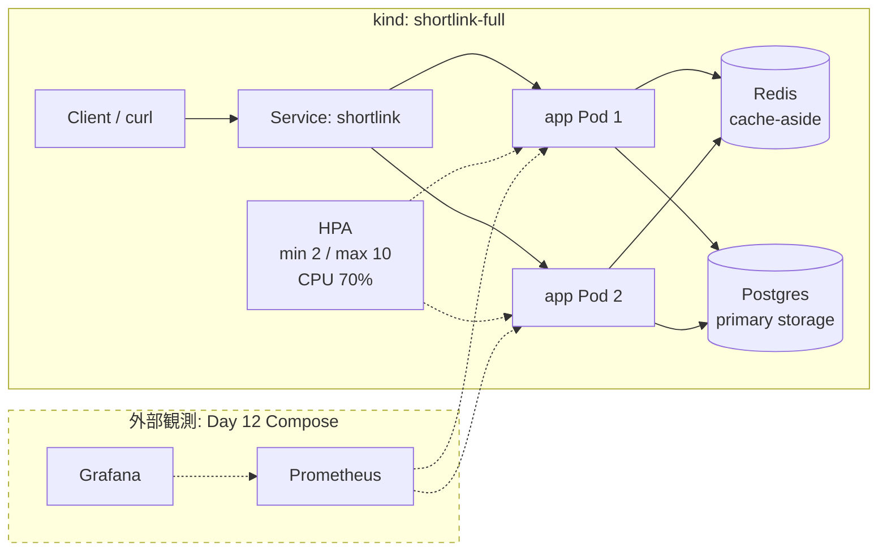

import Quiz from '../../components/Quiz.astro';

:::note[このページのコードについて]
このページは Day 15 時点のコードを解説しています。当時のコードは `git checkout day15` で確認できます。最新のリポジトリには後日の機能追加が含まれます。
:::

## 今日のゴール

- 15日間で URL 短縮サービスがどのように成長したかを、1本のストーリーとして説明できるようになる。
- 最終構成の app、Postgres、Redis、Service、HPA、Prometheus/Grafana の役割を対応づけられるようになる。
- `deploy/k8s/full/` の素朴な YAML 一式を kind に適用し、Pod、Service、HPA、`/readyz`、`302` を確認できるようになる。
- Day 7、Day 8、Day 15 の同一負荷計測を比較し、ローカル環境の数値を誠実に読めるようになる。
- スケーラビリティを「負荷に比例してリソースを足せば性能が維持できる性質」として再定義できるようになる。
- この教材の次に学ぶべき領域を、自分の関心に合わせて選べるようになる。

## 解説

今日は最終日です。
Day 1 で作った小さな Go バイナリは、15日かけて Postgres、Redis、Docker、Kubernetes、HPA、Prometheus メトリクス、レートリミット、分散設計の考え方を持つサービスになりました。

ただし、ここで大事なのは「部品が増えた」ことではありません。
それぞれの部品が、どの制約に対する答えなのかを説明できることです。
URL 短縮という小さな題材でも、保存、並行実行、デプロイ、観測、防御、水平スケール、分散の難しさが順番に出てきました。

今日はその全体像をたどり直し、最後に `deploy/k8s/full/` を kind 上で動かします。
そのあと、Day 7 から Day 15 までの計測値を比較し、スケーラビリティをもう一度定義し直します。

### 15日間の旅

[Day 1](/study-backend-scale/day01/) では、Go の `net/http` だけで最小の URL 短縮サーバを作りました。
1 バイナリで起動し、メモリに `code -> URL` を保存し、`POST /api/links` と `GET /{code}` の最初の契約を決めました。

[Day 2](/study-backend-scale/day02/) では、API の入力と出力を丁寧にしました。
JSON エラー、URL バリデーション、`httptest`、table-driven test により、動くコードを守れるコードへ変えました。

[Day 3](/study-backend-scale/day03/) では、保存先をインターフェースの奥へ隠しました。
メモリ保存から SQLite へ進み、`Storage` インターフェースによって、あとで Postgres や Redis を差し替えられる形を作りました。

[Day 4](/study-backend-scale/day04/) では、クリック統計を題材に Go の並行処理を扱いました。
goroutine、channel、race detector、graceful shutdown を通して、速くする前に壊さないことを学びました。

[Day 5](/study-backend-scale/day05/) では、アプリを Docker イメージにしました。
multi-stage build、distroless、非 root 実行により、手元の Go 環境に依存しない配布単位を作りました。

[Day 6](/study-backend-scale/day06/) では、Docker Compose で app と Postgres を一緒に起動しました。
サービス名 DNS、healthcheck、接続文字列、接続プールによって、1 プロセスのアプリが小さなシステムになりました。

[Day 7](/study-backend-scale/day07/) では、k6 でベースラインを取りました。
p95、req/s、失敗率、thresholds、pprof を使い、「推測するな、計測せよ」をこの教材の軸にしました。

[Day 8](/study-backend-scale/day08/) では、Redis の cache-aside を入れました。
URL 短縮サービスが read-heavy になりやすいこと、キャッシュヒット、ミス、TTL、フォールバックを実コードで確認しました。

[Day 9](/study-backend-scale/day09/) では、kind 上で Kubernetes の入口に立ちました。
Pod、Deployment、ReplicaSet、Service を使い、コンテナをクラスタの宣言的なリソースとして動かしました。

[Day 10](/study-backend-scale/day10/) では、Kubernetes の設定とヘルスチェックを整えました。
ConfigMap、Secret、liveness、readiness、resources、RollingUpdate により、ただ起動する Pod から、運用できる Pod へ進みました。

[Day 11](/study-backend-scale/day11/) では、水平スケールと HPA を扱いました。
プロセス内連番をやめ、ランダム base62 と UNIQUE 制約に寄せることで、複数 Pod で同じように処理できる形にしました。

[Day 12](/study-backend-scale/day12/) では、可観測性を入れました。
Prometheus の counter、histogram、RED メソッド、Grafana、structured logging により、サービスの状態を外から見られるようにしました。

[Day 13](/study-backend-scale/day13/) では、入口で守る設計を学びました。
token bucket のレートリミット、429、タイムアウト、リクエストボディ防御、Redis の graceful fallback で、壊れ方を小さくしました。

[Day 14](/study-backend-scale/day14/) では、さらに大きなスケールの理論へ進みました。
リードレプリカ、シャーディング、consistent hashing、CAP、CDN/エッジを通して、1 台の DB の先にある設計を見ました。

そして Day 15 では、ここまでの部品を全部載せの構成としてまとめます。
Postgres に保存し、Redis で読み取りを逃がし、複数 app Pod を Service の後ろに置き、HPA で増減できるようにし、メトリクスとログで観察できる形にします。

### 最終アーキテクチャ

`deploy/k8s/full/` は、最終構成を kind 上で動作実証するための素朴な Kubernetes マニフェスト一式です。
kustomize は使わず、ファイル名の連番で適用順が分かるようにしています。
Namespace は `shortlink-full` で、Day 9 から Day 11 の `shortlink` Namespace と衝突しません。



クライアントは `Service: shortlink` へアクセスします。
Service は ready な app Pod へトラフィックを分散します。
app Pod はステートレスに近い形で、永続データは Postgres、読み取りの高速化は Redis に任せます。

HPA は CPU 使用率を見て Deployment の replica 数を調整します。
`10-hpa.yaml` では `minReplicas: 2`、`maxReplicas: 10`、CPU 平均利用率 70% を目標にしています。
kind で HPA の数値を見るには metrics-server が必要です。

Prometheus と Grafana は横から観測する存在です。
Day 15 の full マニフェスト自体は app、Postgres、Redis、HPA をまとめる最小構成ですが、アプリは Day 12 で入れた `/metrics` を持っています。
ただし、`deploy/prometheus/prometheus.yml` は Docker Compose の `app:8080` を scrape する設定です。
k8s full は `/metrics` を公開するだけなので、kind 上の Pod を Prometheus で見るには別途 scrape 設定が必要です。
教材では Day 12 の Compose スタックで RED メトリクス、キャッシュ hit/miss、レートリミットを有効にした場合の拒否数を観測します。

### full マニフェストの読みどころ

`00-namespace.yaml` は専用の `shortlink-full` Namespace を作ります。
教材の途中で使った Namespace と分けることで、最終構成を独立して試せます。

`01-configmap.yaml` は機密ではない設定です。
`STORAGE=postgres`、`REDIS_ADDR=redis:6379`、`REQUEST_TIMEOUT=5s` により、Postgres 保存、Redis キャッシュ、リクエスト単位のタイムアウトを有効にします。
`RATE_LIMIT_RPS` と `RATE_LIMIT_BURST` は設定していないため、full 構成ではレートリミットは無効です。
これは最終ベンチマークの数字を 429 で歪めないためです。

`02-secret.yaml` は教材用の接続文字列と Postgres パスワードです。
ここでは分かりやすさのために YAML に値がありますが、本番では Secret 管理、外部 Secret、クラウドの Secret Manager などを使います。

`03-postgres-pvc.yaml` から `05-postgres-service.yaml` は Postgres です。
PVC により Pod 再作成後もデータを残し、Deployment は `Recreate` で単一 Pod と単一 PVC の組み合わせを素朴に扱います。

`06-redis-deployment.yaml` と `07-redis-service.yaml` は Redis です。
Redis はキャッシュなので永続化せず、消えても Postgres へフォールバックできる補助として扱います。

`08-app-deployment.yaml` は最終日の中心です。
app は 2 replicas で始まり、`wait-for-postgres` initContainer で DB の準備を待ち、`/healthz` と `/readyz` の probe を持ちます。

`09-app-service.yaml` は app Pod の前に安定した宛先を作ります。
port-forward ではこの Service に対して `8080:80` を張り、手元の `localhost:8080` からアクセスします。

`10-hpa.yaml` は HPA です。
CPU requests が設定されているからこそ、HPA は利用率を計算できます。
Day 10 の resources と Day 11 の HPA がここでつながります。

## 手を動かす

ここでは `deploy/k8s/full/README.md` に沿って、kind に最終構成を適用します。
リポジトリルートから実行してください。

まず kind クラスタを用意します。
既存の `shortlink` クラスタを使っても構いません。
新しく作る場合は次のコマンドです。

```sh
kind create cluster --name shortlink --config deploy/kind-config.yaml
```

次に、アプリの Docker イメージをビルドします。
`deploy/Dockerfile` を使い、ビルドコンテキストは `app` です。

```sh
docker build -f deploy/Dockerfile -t shortlink:dev app
```

kind クラスタ内へローカルイメージを読み込みます。
`08-app-deployment.yaml` は `imagePullPolicy: Never` なので、外部レジストリではなくこのイメージを使います。

```sh
kind load docker-image shortlink:dev --name shortlink
```

マニフェスト一式を適用します。
ファイル名は Namespace、設定、Secret、Postgres、Redis、app、HPA の順になるように付いています。

```sh
kubectl apply -f deploy/k8s/full
```

作成されたリソースを確認します。

```sh
kubectl get all,pvc,configmap,secret -n shortlink-full
```

期待する見方は、Postgres、Redis、shortlink の Deployment が見え、Postgres 用 PVC が Bound になっていることです。
Secret は値そのものではなく、存在と名前を確認します。

Pod の準備完了を待ちます。
Postgres が ready になり、その後 app の initContainer が抜け、app が ready になる、という順で見るのが自然です。

```sh
kubectl rollout status deployment/postgres -n shortlink-full
kubectl rollout status deployment/redis -n shortlink-full
kubectl rollout status deployment/shortlink -n shortlink-full
```

期待する出力の形です。

```txt
deployment "postgres" successfully rolled out
deployment "redis" successfully rolled out
deployment "shortlink" successfully rolled out
```

HPA を観察する場合は metrics-server が必要です。
kind では、教材で検証している v0.8.1 を入れ、ローカル kind 用に kubelet TLS の扱いを調整します。

```sh
kubectl apply -f https://github.com/kubernetes-sigs/metrics-server/releases/download/v0.8.1/components.yaml
kubectl patch deployment metrics-server -n kube-system --type=json \
  -p='[{"op":"add","path":"/spec/template/spec/containers/0/args/-","value":"--kubelet-insecure-tls"}]'
kubectl rollout status deployment/metrics-server -n kube-system
```

HPA の現在値を確認します。

```sh
kubectl get hpa -n shortlink-full
```

最初は CPU 使用率が `<unknown>` のことがあります。
metrics-server が scrape し始めると、`shortlink` HPA が `2` から `10` の範囲で Deployment を管理していることが分かります。

ローカルからアクセスできるよう、Service へ port-forward します。
このコマンドは実行したままにします。

```sh
kubectl port-forward svc/shortlink 8080:80 -n shortlink-full
```

別のターミナルで health check を確認します。

```sh
curl http://localhost:8080/healthz
curl http://localhost:8080/readyz
```

期待出力はいずれも `ok` です。
`/healthz` はプロセスが HTTP 応答できるか、`/readyz` は Postgres へ ping できるかを見ます。
検証済みの観察点は、Postgres が ready になってから app が ready になり、`/readyz` が 200 になることです。

次に短縮 URL を作ります。

```sh
curl -i -X POST http://localhost:8080/api/links \
  -H 'Content-Type: application/json' \
  -d '{"url":"https://example.com"}'
```

期待する応答の形です。

```txt
HTTP/1.1 201 Created
Content-Type: application/json
Location: http://localhost:8080/<code>

{"code":"<code>","short_url":"http://localhost:8080/<code>"}
```

返ってきた `code` を使って、リダイレクトを確認します。
`-L` は付けず、shortlink アプリが返す `302` と `Location` を見ます。

```sh
curl -i http://localhost:8080/<code>
```

期待する応答の形です。

```txt
HTTP/1.1 302 Found
Location: https://example.com
```

最後に Day 15 の k6 を実行して、full 構成に負荷を流しても動くことを確認できます。
ただし、port-forward 経由の計測はトンネルがボトルネックになりやすいため、Day 7、Day 8、Day 15 の性能比較には使いません。
比較表の最終計測は、Day 7 と同じ 0 VU から 20 VU、50 VU、0 VU の 2 分間、同じ 90% redirect / 10% create のシナリオを Docker Compose 環境で実行した値です。

```sh
BASE_URL=http://localhost:8080 k6 run load/day15-final.js
```

HPA の動きを見る場合は、別ターミナルで watch します。

```sh
kubectl get hpa -n shortlink-full -w
```

教材用のローカル環境では、CPU が目標に届かず Pod 数が大きく増えないこともあります。
大事なのは、HPA リソースが Deployment を対象にし、metrics-server から値を受け取り、必要なら replica 数を変えられる状態になっていることです。

片付けは、マニフェストだけ削除するなら次です。

```sh
kubectl delete -f deploy/k8s/full --ignore-not-found
```

Namespace ごと消す場合は次です。

```sh
kubectl delete namespace shortlink-full
```

クラスタごと消す場合は次です。

```sh
kind delete cluster --name shortlink
```

### 最終計測の比較

Day 7、Day 8、Day 15 は、同じ Docker Compose 環境、同じ負荷条件で比較しています。
条件は 0 VU から 20 VU、50 VU、0 VU の 2 分間、90% redirect / 10% create、threshold は p95 100ms 未満、HTTP 失敗率 1% 未満です。
k8s full は最終構成の動作実証に使い、性能比較は Compose で行います。
これは、k8s full への port-forward 経由の計測ではトンネルがボトルネックになりやすく、Day 7/8 と公平に比較しにくいためです。

| 日 | 条件 | req/s | エラー率 | avg | p95 |
| --- | --- | ---: | ---: | ---: | ---: |
| Day 7 | ベースライン、Postgres のみ | 26.97 | 0% | 1.76ms | 3.04ms |
| Day 8 | Redis キャッシュあり | 約 27 | 0% | 1.56ms | 2.86ms |
| Day 15 | Compose で最終構成相当、メトリクス・ミドルウェア込み、全体 | 約 27 | 0% | 1.51ms | 2.89ms |
| Day 15 | Compose で最終構成相当、リダイレクトのみ | 約 27 | 0% | 1.45ms | 2.66ms |

Day 15 の全体 p95 は 2.89ms、平均は 1.51ms です。
リダイレクトだけを見ると p95 は 2.66ms、平均は 1.45ms です。
いずれもエラー率は 0% でした。

この表は、k8s full の port-forward 性能を示すものでも、派手な改善を主張するためのものでもありません。
むしろ、ローカルの Compose 環境では差が小さい、という事実をそのまま読むための表です。
Postgres も Redis も同じマシン上で軽く動いているため、ネットワーク越しの DB や高いデータ量で起きる差は見えにくいです。

それでも、学ぶ価値は十分にあります。
キャッシュを入れると、人気の code の読み取りを DB から逃がせます。
HPA を入れると、app がステートレスである限り、入口の処理能力を横に増やせます。
メトリクスを入れると、p95、エラー率、キャッシュヒット率、レートリミット拒否を見て、劣化に気づけます。

ローカル測定の絶対値だけを見て「2.89ms だから完成」と考えるのは危険です。
本番に近づくほど、DB の距離、ディスク、接続数、Pod の配置、ノードの CPU、ログ基盤、TLS、ロードバランサ、クラウドの揺らぎが効いてきます。
だからこそ、この教材では数値を一度測って終わりにせず、同じ条件で比較する姿勢を重視しました。

最終日の誠実な締めはこうです。
このリポジトリのローカル計測では、差は小さい。
アーキテクチャの価値は、絶対値の数 ms ではなく、スケールへの備えにあります。
HPA で水平に伸ばせること、キャッシュで DB 負荷を逃がせること、計測で劣化に気づけることが、Day 15 の成果です。

### スケーラビリティの再定義

ここで、スケーラビリティをもう一度定義します。

```txt
スケーラビリティとは、負荷に比例してリソースを足せば性能が維持できる性質です。
```

「台数を増やせること」だけでは足りません。
台数を増やしたときに正しさが壊れず、ボトルネックが別の場所へ移ったことを観察でき、過負荷時に全体を巻き込まないことまで含めて考えます。

Day 1 の 1 バイナリは、理解しやすさをくれました。
小さく始めることで、API 契約と責務の境界を見失わずに済みました。

Day 2 のテスト文化は、変更しても壊していないことを確認する土台です。
スケール対応は内部構造を変えることが多いため、外部契約を守るテストが必要です。

Day 3 のインターフェース設計は、保存先を差し替える余地を作りました。
この余地がなければ、SQLite、Postgres、Redis デコレータへ進むたびにハンドラが壊れていたはずです。

Day 4 の並行処理は、複数リクエストが同時に来る現実への準備です。
race detector と graceful shutdown は、速さより先に正しさと終了処理を守ります。

Day 5 と Day 6 のコンテナと Compose は、実行環境を再現可能にしました。
アプリと DB を別プロセス、別コンテナとして扱うことで、本番に近い依存関係を手元に作れます。

Day 7 の計測は、改善を判断する物差しです。
req/s、p95、失敗率を取らなければ、設計変更が本当に効いたのか分かりません。

Day 8 の Redis は、読み取りを DB から逃がす道具です。
read-heavy なサービスでは、キャッシュヒット率が上がるほど DB の余力を守れます。

Day 9 から Day 11 の Kubernetes と HPA は、アプリの実行単位を横に増やす道具です。
Service、readiness、resources、HPA が揃って初めて、Pod を増やしてもトラフィックを安全に流せます。

Day 12 の可観測性は、増やしたあとに何が起きたかを見る道具です。
見えないシステムは、スケールしているのか、ただ遅くなっているのか判断できません。

Day 13 の防御は、過負荷を内側へ伝播させない道具です。
レートリミットとタイムアウトは、限界を超えたときの壊れ方を制御します。

Day 14 の分散理論は、単一 DB の先を考える道具です。
リードレプリカ、シャーディング、consistent hashing、CAP は、次のボトルネックがどこに現れるかを考える語彙になります。

Day 15 の全部載せは、それらを 1 つの絵に戻す日です。
スケーラビリティは単一の技術名ではなく、設計、実装、デプロイ、計測、運用判断の組み合わせです。

## クイズ

<Quiz question="Day 15 の最終構成で、app Pod を複数にしても正しさを保ちやすい主な理由はどれですか？" choices={['短縮コードの採番状態を Pod 内の連番に持たず、Postgres の UNIQUE 制約で一意性を確認するから', 'Service がすべてのリクエストを必ず同じ Pod に固定するから', 'Redis にすべての永続データを保存しているから', 'HPA が DB の書き込み衝突を自動解決するから']} answer={0} explanation="Day 11 でプロセス内連番をやめ、ランダム base62 と保存時の UNIQUE 制約、衝突リトライにしました。Pod ごとのローカル状態に依存しないため水平スケールしやすくなります。" />

<Quiz question="`/healthz` と `/readyz` の違いとして正しいものはどれですか？" choices={['/healthz はプロセスの生存確認、/readyz は Postgres へ ping できるかを含む受け入れ可能性の確認', '/healthz は Redis 専用、/readyz は Grafana 専用', '/healthz は必ず 302 を返し、/readyz は必ず 404 を返す', 'どちらも同じなので Kubernetes では片方だけしか使えない']} answer={0} explanation="/healthz は liveness 用に外部依存を見ず、/readyz は readiness 用に storage へ ping します。DB が準備できない Pod を Service の転送先に入れないためです。" />

<Quiz question="Day 15 の HPA が CPU 利用率を計算するために、Deployment 側で重要な設定はどれですか？" choices={['resources.requests.cpu', 'containerPort の名前', 'Secret の type: Opaque', 'PVC の accessModes']} answer={0} explanation="HPA の CPU 利用率は CPU requests に対する使用率として計算されます。requests がないと、CPU 利用率ベースの HPA が期待どおり動きません。" />

<Quiz question="Day 7、Day 8、Day 15 の計測を比較するとき、最も大事な前提はどれですか？" choices={['同じ負荷条件、同じシナリオ、同じ環境で比較すること', '毎回違う VU 数にして最大値だけを見ること', '平均値だけを見て p95 と失敗率を無視すること', 'Redis の有無に関係なく DB を止めて測ること']} answer={0} explanation="改善比較は条件をそろえて初めて意味があります。この教材では Docker Compose 環境で 0→20→50VU/2分、90% redirect / 10% create、同じ thresholds で比較しています。k8s full は動作実証として扱います。" />

<Quiz question="ローカル計測で Day 7 と Day 15 の p95 差が小さいとき、最も誠実な読み方はどれですか？" choices={['ローカルでは DB や Redis が近く差が小さいが、構成の価値は水平スケール、DB 負荷逃がし、劣化検知への備えにある', 'Redis と HPA は必ず不要だと断定できる', 'p95 が 3ms 前後なら監視は一切不要になる', 'エラー率 0% なら本番でも必ず同じ結果になる']} answer={0} explanation="ローカルの絶対値だけで本番の価値を断定しません。キャッシュ、HPA、可観測性は、負荷や運用条件が大きくなったときに効く備えです。" />

<Quiz question="Redis cache-aside の説明として正しいものはどれですか？" choices={['まず Redis を読み、miss したら Postgres を読み、見つかった値を TTL 付きで Redis に保存する', 'すべての書き込みを Redis だけに保存し、Postgres は使わない', 'Redis が落ちたら必ず 500 を返す', 'TTL は Kubernetes の Pod 数を決める設定である']} answer={0} explanation="Day 8 の Redis は補助的なキャッシュです。miss 時は Postgres にフォールバックし、見つかった値を Redis に保存します。Redis 障害時も Postgres から返せる設計です。" />

<Quiz question="Prometheus の RED メソッドに含まれないものはどれですか？" choices={['ReplicaSet', 'Rate', 'Errors', 'Duration']} answer={0} explanation="RED は Rate、Errors、Duration です。ReplicaSet は Kubernetes のリソースであり、RED メソッドの指標名ではありません。" />

<Quiz question="レートリミットとタイムアウトの役割として最も近いものはどれですか？" choices={['入口で量と待ち時間を制御し、下流の DB や Redis へ過負荷を伝播させにくくする', 'Postgres のデータを自動でシャーディングする', 'Prometheus のメトリクス保存期間を延ばす', 'Docker イメージのサイズを小さくする']} answer={0} explanation="Day 13 の防御は、暴走クライアントやスパイクをそのまま下流へ流さないためのものです。量はレートリミット、待ち時間はタイムアウトで制御します。" />

<Quiz question="consistent hashing が `hash(key) % N` より有利な場面はどれですか？" choices={['ノード数を増減したときに、移動する key の割合を小さくしたい場面', '1 台の DB の SQL 文をすべて速くしたい場面', 'HTTP の 302 を 201 に変えたい場面', 'JSON のバリデーションを省略したい場面']} answer={0} explanation="mod N は N が変わると多くの key が移動します。consistent hashing は追加されたノードの担当範囲だけを主に動かせるため、再配置を小さくできます。" />

<Quiz question="この教材でのスケーラビリティの定義として最も近いものはどれですか？" choices={['負荷に比例してリソースを足せば性能が維持できる性質', '1 台のマシンを絶対に再起動しない性質', 'すべてのデータをメモリだけに置く性質', '平均レイテンシだけを短くする性質']} answer={0} explanation="スケーラビリティは、単に速いことや台数を増やすことではありません。負荷が増えたとき、適切にリソースを足して性能と正しさを維持できる性質です。" />

## 今後の学習ロードマップ

gRPC は、サービス間通信を型付きの契約として扱うための有力な選択肢です。
HTTP JSON より効率が良い場面があり、IDL、コード生成、ストリーミング、互換性管理を学べます。

service mesh は、サービス間通信のリトライ、タイムアウト、mTLS、メトリクスをアプリの外側で扱う考え方です。
Kubernetes 上でサービス数が増えたとき、通信の運用をどこまで共通化するかを考える材料になります。

Kafka や非同期処理は、リクエスト中にすべてを同期実行しない設計を学ぶ入口です。
クリック集計、通知、ログ処理、再試行可能なジョブなど、ユーザー応答から切り離せる処理を扱いやすくなります。

EKS や GKE のようなマネージド Kubernetes は、kind の次に触る価値があります。
コントロールプレーン、ロードバランサ、永続ボリューム、IAM、クラスタアップグレードが、ローカル教材とは違う現実の制約として見えてきます。

Terraform などの IaC は、クラウドリソースを手作業ではなくコードで再現するための道具です。
Kubernetes マニフェストだけでなく、VPC、DB、Redis、DNS、証明書、権限をどう管理するかを学べます。

SRE の本は、個別技術を信頼性の考え方へつなげてくれます。
SLI、SLO、エラーバジェット、オンコール、ポストモーテムを学ぶと、計測値を「運用判断」に変える視点が身につきます。

## 今日のまとめ

今日は、15日間の URL 短縮サービスを総仕上げしました。
1 バイナリから始めたサービスは、Postgres に保存し、Redis で読み取りを逃がし、Kubernetes の Service と Deployment の後ろで複数 Pod として動き、HPA で増減できる形になりました。

最終構成を kind に適用すると、Postgres、Redis、app、HPA が `shortlink-full` Namespace に並びます。
Postgres が ready になってから app が ready になり、`/readyz` は 200、作成 API は 201、リダイレクトは 302 を返します。

計測では、同じ Docker Compose 環境で Day 7 のベースライン p95 3.04ms、Day 8 のキャッシュ p95 2.86ms、Day 15 の全部載せ全体 p95 2.89ms、リダイレクトのみ p95 2.66ms を比較しました。
ローカルでは差が小さいことも含めて、正直に読みます。

この教材で得た一番大事なものは、特定のツール名ではありません。
負荷が増えたとき、どこを増やすのか。
どこをキャッシュするのか。
何を測るのか。
どこで止めるのか。
どの一貫性を守り、どの遅延や古さを許すのか。
それを説明するための地図です。

スケーラビリティとは、負荷に比例してリソースを足せば性能が維持できる性質です。
15日間の shortlink は、その性質を小さな題材で練習するための土台です。
ここから先は、より大きな通信、より大きなデータ、より厳しい信頼性、より現実的なクラウド運用へ進んでください。
